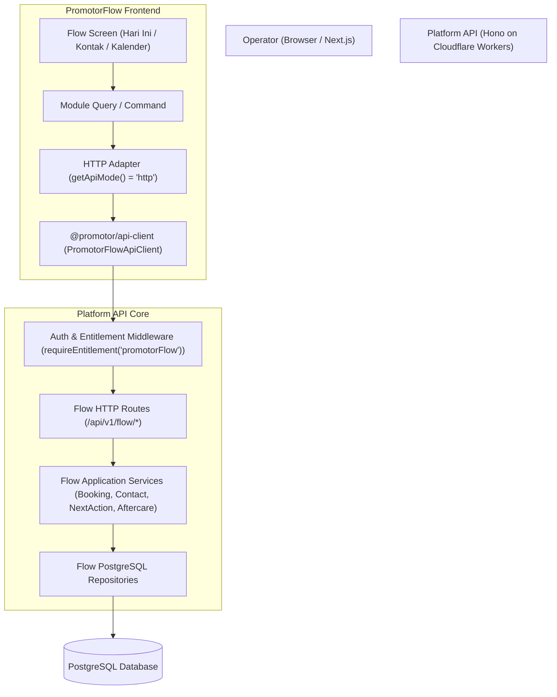

# Milestone B6 — PromotorFlow Core Domain

**Status:** FINAL ACCEPTED / FROZEN
**Date:** 2026-08-18
**Base Master:** `f44b949399647b344c1582dd86656546a79fceae`
**PRs in Milestone B6 Core:**
- **PR #23 (PR 4)**: Pure Domain Invariants (`feat/b6-domain-rules`) — *Merged*
- **PR #24 (PR 3)**: PostgreSQL Repositories (`feat/b6-repositories`) — *Merged*
- **PR #25 (PR 5)**: Application Services & Integration (`feat/b6-flow-services`) — *Merged*
- **PR #26 (PR 6)**: PromotorClass Integration Seam (`feat/b6-class-seam`) — *Merged*
- **PR #27 (PR 7)**: Flow HTTP API Routes & Transport Contracts (`feat/b6-flow-api`) — *Merged*
- **PR #28 (PR 8)**: Frontend HTTP Migration, Rehearsal Tooling & Documentation (`feat/b6-rehearsal-docs`) — *Active*

---

## 1. Executive Summary & Verification Record

PromotorFlow is the customer relationship, booking lifecycle, and next-action execution engine of the Promotor platform. Milestone B6 implements the complete Core Domain of PromotorFlow, bridging Shared Core identity (`contacts`, `organizations`, `users`) with PromotorClass learning signals, backed by PostgreSQL persistence with true database-level append-only least privilege.

```text
================================================================================
                    B6 MILESTONE CONSOLIDATED VERIFICATION
================================================================================
Workspace Typecheck (9 projects)        : PASS (9 / 9)
Workspace Linter (9 projects)           : PASS (clean, 0 warnings, 0 errors)
Workspace Unit Tests                    : PASS (74 / 74 unit tests green)
PostgreSQL Integration Test Surface     : PASS (104 / 104 tests green across 5 suites)
  - b6-flow-api.integration.test.ts     : 26 / 26 passed (Auth, Contacts, Services, Bookings, NextActions)
  - b6-flow-services.integration.test.ts: 28 / 28 passed (Booking state machine, Aftercare, NextActions)
  - b6-flow-repositories.integration.ts : 17 / 17 passed (CRUD, Partial unique, Locks, Multi-tenant isolation)
  - b6-flow-schema-grants.integration.ts: 19 / 19 passed (Schema constraints, CHECKs, RESTRICT FKs)
  - b6-class-seam.integration.test.ts   : 14 / 14 passed (Cross-product learning context & NextAction seam)
PromotorClass Web Production Build      : PASS
PromotorFlow Web Production Build       : PASS (Production HTTP mode validated)
Platform API Worker Bundle Build        : PASS
Runtime Capability Invariants           : PASS (94 / 94 capability checks intact)
Migration 0003 Fingerprint              : PASS (02e0f59281c6aadb85f1d8d16d7be6ec15ecb012e38d2fd763c2dd37b06275fe)
================================================================================
```

---

## 2. Architecture & Domain Boundaries

### 2.1 Three-Pillar Platform Architecture
1. **Shared Core (`@promotor/contracts`, `@promotor/platform-core`)**:
   - Owns identity and tenant isolation: `organizations`, `users`, `organization_members`, `contacts`, `product_entitlements`.
   - Contact identity (`id`, `name`, `phone_e164`, `email`, `deleted_at`) is unique per tenant.
2. **PromotorClass (`apps/promotor-class-web`, `programs`, `lessons`, `enrollments`)**:
   - Owns structured learning curriculum, lesson content, reflections, and learning signals.
   - Does **NOT** own next actions or customer lifecycle stages.
3. **PromotorFlow (`apps/promotor-flow-web`, `apps/platform-api/src/services/*`)**:
   - Owns operational sales pipeline, next actions queue, booking lifecycles, service catalogs, message templates, activity history, and aftercare.
   - Sole authority for `next_actions` and `contact.stage`.



---

## 3. Database Schema & Least Privilege (Migration `0003`)

Migration `0003_smart_titania.sql` introduces 8 tables for the PromotorFlow domain with rigorous relational integrity, check constraints, and partial indexes.

### 3.1 Flow Tables Summary
| Table Name | Description | Key Constraints & Invariants |
|---|---|---|
| `flow_contact_profiles` | Flow contact extensions | `interest TEXT NULL`, `notes TEXT NULL`, `stage TEXT NOT NULL DEFAULT 'NEW'`, `classification TEXT NOT NULL DEFAULT 'PROSPECT'`, `UNIQUE (organization_id, contact_id)` |
| `services` | Organization service offerings | `category TEXT NOT NULL`, `price_amount INTEGER >= 0`, `deposit_amount INTEGER >= 0`, `duration_minutes INTEGER >= 1`, `is_active BOOLEAN` |
| `message_templates` | WhatsApp/SMS templates | `category TEXT NOT NULL`, `body_text TEXT NOT NULL`, `is_active BOOLEAN` |
| `bookings` | Appointments & consultations | `amount INTEGER >= 0` (server snapshot), `status` state machine, `payment_status`, `start_at < end_at` |
| `flow_activities` | Append-only audit history | `actor_user_id` server authenticated only, `event_type` 21 canonical types, **Database-level append-only** |
| `next_actions` | Action queue items | `action_type`, `priority` (1-100), `due_at`, partial unique for idempotency, `status` (`PENDING`, `COMPLETED`, `SKIPPED`, `CANCELLED`) |
| `aftercare_records` | Post-booking follow-ups | `scheduled_for = booking.end_at + 7 days`, `outcome` enum, `UNIQUE (organization_id, booking_id)` |
| `flow_assessment_records` | Assessment context | `status` (`NOT_STARTED`, `SCHEDULED`, `COMPLETED`, `CANCELLED`), `UNIQUE (organization_id, contact_id)` |

### 3.2 Runtime Grants & Privilege Arithmetic (94 / 94)
- **B1 Shared Core (5 tables)**: 5 × 4 (SELECT, INSERT, UPDATE, DELETE) = **20** capabilities.
- **B2 Auth (5 tables)**: 5 × 4 = **20** capabilities.
- **B3 PromotorClass (6 tables)**: 6 × 4 = **24** capabilities.
- **B6 PromotorFlow (8 tables)**:
  - 7 tables × 4 (SELECT, INSERT, UPDATE, DELETE) = 28 capabilities.
  - 1 table (`flow_activities`) × 2 (SELECT, INSERT only; UPDATE and DELETE denied) = **2** capabilities.
  - Subtotal: **30** capabilities.
- **Total Runtime Capabilities**: 20 + 20 + 24 + 30 = **94 / 94**.
- **DDL Denial**: `has_schema_privilege('promotor_runtime', 'public', 'CREATE') === false`.

---

## 4. State Machines & Critical Domain Invariants

### 4.1 Booking Lifecycle State Matrix
The booking status follows a strict, non-reversible state machine:
```text
[ PENDING ] ──(confirm)──> [ CONFIRMED ] ──(complete)──> [ COMPLETED ]
     │                           │
     ├──(reschedule)─────────────┤
     │                           │
     ├──(cancel)─────────────────┼──(cancel)────────────> [ CANCELLED ]
     │                           │
     └──(no-show)────────────────┴──(no-show)───────────> [ NO_SHOW ]
```
- **Creation Amount Snapshot**: The browser *never* supplies booking amount. The server reads `services.price_amount` and snapshots it to `bookings.amount`.
- **Payment Mutation**: Marking `PAID` cancels any pending `REMIND_PAYMENT` next action and creates a `CONFIRM_BOOKING` next action.
- **Completion Effects**:
  - Contact classification is sticky-promoted to `CLIENT`.
  - Stale pending booking actions are automatically cancelled.
  - Exactly one `aftercare_record` is scheduled at $D+7$ (`booking.end_at + 7 days`).
- **Terminal States**: `CANCELLED` and `NO_SHOW` reject further mutations with `INVALID_BOOKING_STATE`.

### 4.2 Next Actions & Quiet Operations UX
- **Action Timing & Due Grouping**:
  - `Overdue`: `due_at < startOfToday(Asia/Jakarta)`.
  - `Today`: `startOfToday <= due_at <= endOfToday`.
  - `Upcoming`: `due_at > endOfToday`.
- **Deterministic Priority & Selection**:
  - Effective priority adjusts dynamically within 24h/72h boundaries.
  - Primary candidate selection resolves deterministically: `effective_priority DESC` $\rightarrow$ `due_at ASC` $\rightarrow$ `created_at ASC`.
- **Skip Guard**: `skipAction` strictly requires a `nextStep` configuration (`{ type, dueAt?, title?, description? }`).
- **WhatsApp Messaging Rule**:
  - Clicking a `wa.me` link triggers `POST /api/v1/flow/messaging/whatsapp-opened` $\rightarrow$ records `WHATSAPP_OPENED` but does **NOT** complete the action.
  - Action completion requires explicit human confirmation via `POST /api/v1/flow/messaging/confirm-sent` $\rightarrow$ records `WHATSAPP_SENT` and `ACTION_COMPLETED`.

### 4.3 Aftercare Temporal Guard
- Aftercare records cannot be completed before `scheduled_for` ($D+7$).
- Attempting early completion returns canonical error: `AFTERCARE_NOT_DUE`.
- Repeating completion on an already completed aftercare record is an idempotent no-op.

---

## 5. PromotorClass $\leftrightarrow$ PromotorFlow Seam

The seam between PromotorClass and PromotorFlow is defined cleanly without direct cross-database dependencies:
1. `getContactContext(contactId)`: Queries Shared Core contact identity and joins Flow lifecycle stage and assessment status.
2. `getAssessmentStatus(contactId)`: Resolves highest assessment evidence ranking: `COMPLETED (4) > SCHEDULED (3) > CANCELLED (2) > NOT_STARTED (1)`.
3. `createNextAction(action)`: Idempotently creates next actions triggered by Class events (e.g. course completion).
4. `appendLearningActivity(activity)`: Appends trusted server activity projections (`CLASS_SIGNAL`) into Flow audit history without copying raw lesson reflections.

---

## 6. Frontend HTTP Architecture & Adapter Factory

In PR 8, PromotorFlow frontend (`@promotor/promotor-flow-web`) was migrated to communicate exclusively with the Platform API via `@promotor/api-client`:

```text
Flow Screen  ──>  Module Query / Command  ──>  Port  ──>  HTTP Adapter  ──>  PromotorFlowApiClient  ──>  /api/v1/flow/*
```

### 6.1 Environment Gating & Fail-Closed Policy
- **Production Mode (`NODE_ENV === 'production'`)**: Strictly requires `NEXT_PUBLIC_API_MODE="http"`. If mock mode is requested or environment is missing, the adapter factory fails closed immediately with:
  `[Adapter Factory] Production environment requires NEXT_PUBLIC_API_MODE="http". Mock mode is strictly forbidden in production.`
- **Development / Demo Mode**: Explicitly allows `mock` mode for local offline prototyping.
- **Tenant Context Security**: The frontend passes no client-trusted `organizationId`. The backend derives organization context strictly from authenticated session cookies (`sessionMiddleware` + `requireOrganization()`).

---

## 7. Live Acceptance & Rehearsal Tooling

A dedicated acceptance tool is provided in `tooling/b6-live-acceptance.ts` (runnable via `pnpm rehearsal:b6` or `pnpm --filter @promotor/platform-api b6:live-acceptance`).

### 7.1 Verification Surface Checked by Tooling
- Migration `0003` SHA-256 byte-identity against `02e0f59281c6aadb85f1d8d16d7be6ec15ecb012e38d2fd763c2dd37b06275fe`.
- Runtime role visibility of all 8 Flow tables.
- Runtime role 94 least-privilege CRUD grant count and DDL rejection.
- Unauthenticated 401 gate on `/api/v1/flow/*`.
- Authenticated `GET /api/v1/flow/today` read model.
- Contact creation with non-empty `interest` and `NEW` stage.
- Contact lifecycle stage transition to `INTERESTED`.
- Server price snapshot on `POST /api/v1/flow/bookings`.
- Booking lifecycle transitions: `confirm` $\rightarrow$ `mark-paid` $\rightarrow$ `complete` (sticky `CLIENT` + $D+7$ aftercare).
- WhatsApp open vs explicit confirmation semantics.

---

## 8. Milestone B6.1 Next Steps (Public Booking & Availability V0.1)

With Milestone B6 Core Domain frozen and validated:
1. Rebase onto latest canonical `master`.
2. Inspect current migration journal to take the next sequential migration index (`0004`).
3. Implement `B6.1 — PromotorFlow Public Booking & Availability V0.1`:
   - Public slot query: `GET /api/v1/public/:slug/slots`.
   - Public booking submission: `POST /api/v1/public/:slug/bookings`.
   - Weekly availability rules schema & repository.
